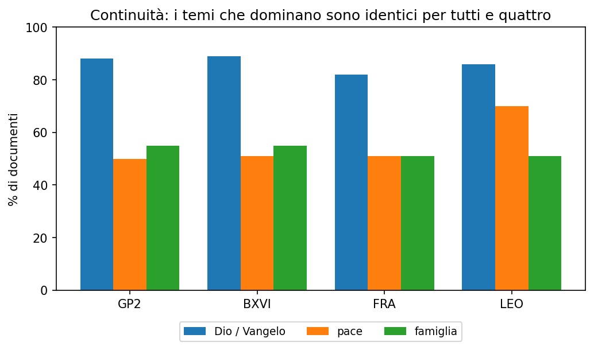

# Di cosa parlano davvero i Papi

*Abbiamo preso venticinquemila discorsi di quattro Papi e li abbiamo contati. Per
rispondere, una buona volta, alle domande che ci facevamo al bar.*

---

Succede a tutti, una sera, davanti a un giornale: *"ma questo Papa è comunista?
Ha rotto con quelli di prima? Parla solo di migranti?"*. Domande vere, di quelle
sul senso delle cose e sulla fede, che però finiscono sempre a colpi di
impressioni. A un certo punto ci siamo detti: invece di tirare a indovinare,
**guardiamo i dati**.

Così abbiamo raccolto circa **venticinquemila testi** dei quattro Papi più
recenti — Giovanni Paolo II, Benedetto XVI, Francesco e Leone XIV — e li abbiamo
fatti leggere a un programma capace non solo di cercare le parole, ma di capire il
**senso** delle frasi. Poi abbiamo contato. Ecco cosa è venuto fuori.

## Di cosa è fatto un Papa

Partiamo dalla domanda più semplice: se prendi *tutto* quello che dice un Papa, di
cosa è fatto? Abbiamo diviso gli argomenti in sei grandi famiglie — la liturgia,
la fede e la devozione, gli eventi che gli organizzano, i viaggi, il programma del
pontificato, l'attualità — e abbiamo assegnato ogni passaggio dei discorsi alla
sua. Non i discorsi interi: i *pezzi*, perché un'omelia può parlare di liturgia e
di attualità nella stessa pagina (succede, in media, in più di metà dei testi).

Il risultato è netto e un po' spiazzante: **circa l'80% di tutto è la stessa
cosa**, per tutti e quattro. Dio, Gesù, Maria, il Vangelo, i sacramenti — la
chiameremo *la lunga linea rossa*. È il fondo comune, identico da un Papa
all'altro. I temi "da prima pagina" vivono tutti nel **20% che resta**: ed è lì,
in quella fascia sottile, che si vedono le differenze. L'attualità pesa di più in
Francesco e Leone; i viaggi in Giovanni Paolo II, il Papa che ha girato il mondo.

## La stessa voce

E allora la continuità? Quella di cui si dice sempre che "con Francesco si è
rotta"?

I tre temi che dominano — parlare di Dio e del Vangelo, della pace, della famiglia
— tornano **uguali per tutti e quattro**, quasi alle stesse percentuali: Dio e
Vangelo intorno all'85% dei documenti, la pace e la famiglia intorno alla metà. Su
questo i Papi sono **la stessa voce**. Francesco non è un corpo estraneo arrivato
a cambiare le carte: cambia gli **accenti**, non la sostanza.

## E allora, comunista?

Veniamo al punto caldo. Sì: Francesco parla **davvero** più degli altri di poveri,
migranti, disuguaglianze. È il suo timbro, e i numeri lo confermano senza giri di
parole.

Ma due cose raddrizzano subito il titolo da bar. La prima: sono temi **minori**
rispetto a Dio, alla pace, alla famiglia — e **li trattano tutti**. È la dottrina
sociale della Chiesa, vecchia di oltre un secolo, non un'invenzione di sinistra.
La seconda è la più bella: guardate la colonna del **lavoro e degli operai**. Il
primo non è Francesco — è **Giovanni Paolo II**, il doppio degli altri. Cioè
proprio il Papa che ha contribuito a far *cadere* il comunismo. Parlare di poveri
e di operai, evidentemente, non rende comunisti.

Stessa storia per l'ambiente, l'altro cavallo di battaglia dei titoli: ne parlano
tutti più o meno allo stesso modo. Quello che è *davvero* di Francesco non è il
tema, è il **modo di dirlo** — la formula "casa comune" della *Laudato si'*. Il
tema è di tutti; la frase è la sua firma.

## La morale

I numeri smontano il titolo di giornale e fanno vedere una cosa più semplice e più
vera: **la continuità**. Non un Papa contro gli altri, ma una voce sola che cambia
accento e parole su un filo che resta lo stesso. In una riga:

> **Francesco cambia gli accenti, non la sostanza. Continuità piena, comunismo no.**

---

*Una nota onesta. Qui abbiamo guardato solo conteggi e percentuali, mai
ripubblicato i testi (sono dei loro autori). È uno strumento ancora giovane, e
qualche numero andrà limato — ma la direzione si vede, ed è solida.*
