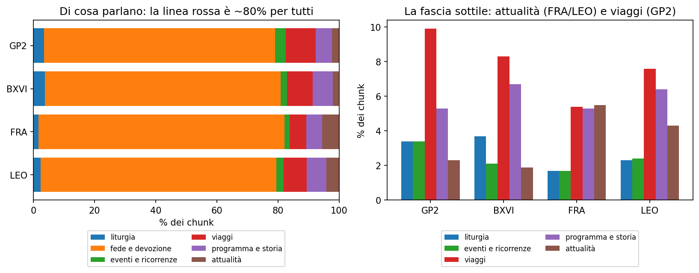
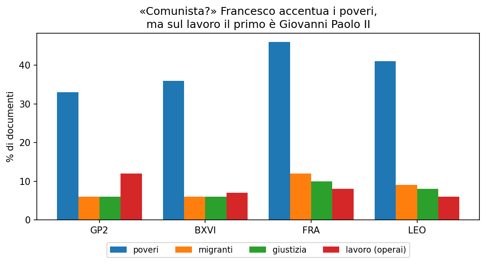

# Di cosa parlano davvero i Papi

*Abbiamo preso venticinquemila discorsi di quattro Papi e li abbiamo contati. Per
rispondere, una buona volta, alle domande che ci facevamo al bar — una tira
l'altra.*

---

Succede a tutti, una sera, davanti a un giornale: *"ma questo Papa è comunista? Ha
rotto con quelli di prima? Parla solo di migranti?"*. Domande vere, di quelle sul
senso delle cose e sulla fede, che però finiscono sempre a colpi di impressioni. A
un certo punto ci siamo detti: invece di tirare a indovinare, **guardiamo i dati**.

Abbiamo raccolto circa **venticinquemila testi** dei quattro Papi più recenti —
Giovanni Paolo II, Benedetto XVI, Francesco e Leone XIV — e li abbiamo fatti
leggere a un programma capace non solo di cercare le parole, ma di capire il
**senso** delle frasi. Poi abbiamo seguito le domande, una alla volta, lasciando
che ogni risposta ne aprisse un'altra.

## Prima domanda: di cosa è fatto un Papa?

**La domanda.** Se prendi *tutto* quello che dice un Papa, di che cosa è fatto,
davvero?

**In numeri.** Abbiamo descritto sei grandi famiglie di argomenti (liturgia; fede
e devozione; gli eventi che gli organizzano; i viaggi; il programma del
pontificato; l'attualità) e poi, per **significato**, abbiamo assegnato ogni
*passaggio* dei discorsi alla famiglia più affine. Non i discorsi interi: i pezzi
— perché un'omelia mischia liturgia e attualità nella stessa pagina.[^struttura]

**La risposta.** Circa l'**80% di tutto è la stessa cosa**, per tutti e quattro:
Dio, Gesù, Maria, il Vangelo, i sacramenti — la *lunga linea rossa*. I temi "da
prima pagina" vivono nel **20% che resta**.

**La domanda che ne nasce.** Ma se il fondo è identico per tutti, allora dov'è
finita la "rottura" di cui si parla sempre con Francesco?

## Seconda domanda: continuità o rottura?

**La domanda.** I temi portanti sono gli stessi da un pontificato all'altro, o
Francesco ha davvero cambiato musica?

**In numeri.** Qui non ci siamo fidati di un metodo solo. Abbiamo misurato i temi
dominanti **a significato** (il programma capisce il senso delle frasi) e
**ricontrollato a parole** (le parole chiave secche). E, come controprova, abbiamo
lasciato che i temi **emergessero da soli** dai testi, raggruppando i discorsi per
vicinanza di senso senza suggerirgliene nessuno.[^continuita]

**La risposta.** **Continuità schiacciante.** I temi che dominano — parlare di Dio
e del Vangelo, della pace, della famiglia — tornano quasi alle stesse percentuali
per tutti e quattro. E lo si vede da ogni angolazione: misurati a significato
(qui sotto), confermati a parole, e ritrovati quando i temi emergono da soli — i
gruppi più grandi, quelli liturgici e devozionali, ricorrono per **tutti**; solo i
gruppi piccoli portano una firma personale.[^topic] Su questo i Papi sono **la
stessa voce**: Francesco cambia gli accenti, non la sostanza.

**La domanda che ne nasce.** E allora quel sospetto da bar — "è comunista" — da
dove salta fuori? Qualcosa di diverso, in Francesco, ci sarà pure.

## Terza domanda: Francesco è comunista?

**La domanda.** I poveri, i migranti, le disuguaglianze: sono *davvero* una sua
fissazione? E basta questo a fare di un Papa un comunista?

**In numeri.** Stesso conteggio dei temi, puntato sui temi "sociali" — poveri,
migranti, giustizia, lavoro — e confrontato fra i quattro.[^sociali]

**La risposta.** Sì, Francesco **accentua** davvero poveri, migranti e
disuguaglianze: è il suo timbro. Ma due cose raddrizzano il titolo. Primo: sono
temi **minori** rispetto a Dio/pace/famiglia, e **li trattano tutti** — è la
dottrina sociale della Chiesa, vecchia di oltre un secolo. Secondo, la prova del
nove: guardate la colonna del **lavoro e degli operai**. Il primo non è Francesco
— è **Giovanni Paolo II**, il doppio degli altri. Cioè il Papa che ha contribuito
a far *cadere* il comunismo. Parlare di poveri non rende comunisti.

Stessa storia per l'ambiente: ne parlano tutti più o meno allo stesso modo. Quello
che è *davvero* di Francesco non è il tema, è il **modo di dirlo** — la formula
"casa comune" della *Laudato si'*.[^ambiente]

## La morale

Seguendo le domande una dopo l'altra si arriva sempre lì: i numeri smontano il
titolo di giornale e fanno vedere la **continuità**. Non un Papa contro gli altri,
ma una voce sola che cambia accento e parole su un filo che resta. In una riga:

> **Francesco cambia gli accenti, non la sostanza. Continuità piena, comunismo no.**

---

*Una nota onesta. Qui abbiamo guardato solo conteggi e percentuali, mai
ripubblicato i testi (sono dei loro autori). È uno strumento ancora giovane, e
qualche numero andrà limato — ma la direzione si vede, ed è solida.*

[^struttura]: Ogni *passaggio* è assegnato, **per significato** (embedding, non
per parole), alla più vicina fra sei famiglie-ancora; la quota di passaggi per
famiglia dà la composizione. La linea rossa = «fede e devozione» + «liturgia».
*Appendice tecnica*, §1.

[^continuita]: Temi dominanti misurati **a significato** e **a parole** (i due
concordano); il `lift` direbbe quanto un Papa sta sopra/sotto la media — qui è
~1 per tutti, cioè nessuno si stacca. *Appendice tecnica*, §2.

[^topic]: Controprova senza temi imposti: i discorsi sono raggruppati per
vicinanza di significato e i gruppi più grandi (liturgico-devozionali) compaiono
per tutti e quattro. *Appendice tecnica*, §4.

[^sociali]: Stesso conteggio del §2, sui temi sociali. Che il lavoro/operai sia
primo in Giovanni Paolo II vale **sia a parole sia a significato**. *Appendice
tecnica*, §2.

[^ambiente]: Quota di documenti sull'ambiente quasi identica per i quattro; la
differenza è la **frase** "casa comune", non il tema. *Appendice tecnica*, §3.
