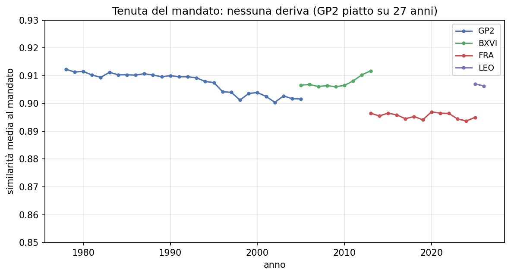

# Hanno mantenuto le promesse?

*Il primo giorno ogni Papa dichiara la sua linea. Poi, per anni, fa altro. Quella
linea regge, o si perde per strada? Abbiamo provato a misurarlo.*

---

C'è un sospetto che vale per i Papi come per i politici: *si dice una cosa appena
arrivati, e poi ce ne si dimentica*. Con i Papi, però, c'è un punto fermo da cui
partire. Appena eletto, ognuno celebra una **messa di inizio pontificato** e
pronuncia un'omelia che è, a tutti gli effetti, il suo **programma**: la riga che
intende seguire. Giovanni Paolo II disse *"Non abbiate paura, aprite le porte a
Cristo"*; Francesco parlò del **custodire**, della tenerezza, di chi resta ai
margini.

La domanda allora diventa concreta: quel discorso del primo giorno **resta** la
bussola di tutto il pontificato, o sbiadisce con gli anni?

## Come si misura una promessa

Abbiamo preso l'omelia inaugurale di ciascuno e l'abbiamo usata come **pietra di
paragone**. Poi, anno per anno, abbiamo chiesto al programma: *quanto i discorsi
di quest'anno assomigliano, nel contenuto, a quello che avevi promesso il primo
giorno?* Più la risposta resta alta e costante, più quel Papa è rimasto fedele
alla sua linea. Se calasse col tempo, vorrebbe dire che si è allontanato.

## Tutti la tengono

Il grafico parla da solo: ogni linea è **piatta**. Non c'è deriva. Giovanni Paolo
II — la linea più lunga, **ventisette anni** — finisce dov'era partito. Benedetto,
Francesco, Leone: lo stesso. La rotta dichiarata il primo giorno è quella di
sempre.

Una precisazione, per leggere bene il disegno: conta la **piattezza** di ciascuna
linea, non la sua altezza. Ogni Papa è confrontato con il *suo* discorso, non con
quello degli altri — quindi non ha senso dire "questo è più in alto di
quell'altro". Quello che conta è che nessuna linea **scende**.

## Un limite, detto chiaro

Una cosa non possiamo dirla, ed è giusto ammetterlo: stiamo guardando solo i
testi **da Papa**. Non abbiamo i discorsi di prima, da cardinale. Quindi possiamo
dire che ognuno è rimasto coerente *dentro* il suo pontificato — non che "era già
così" prima di salire al soglio. È un confronto onesto ma circoscritto: la fedeltà
alla parola data il primo giorno, misurata sui giorni che seguono.

## La conclusione

Tolto quel limite, la risposta è limpida e perfino rassicurante:

> **Ognuno, alla sua maniera, ha tenuto la linea che aveva dichiarato il primo
> giorno. La promessa del primo giorno non era un titolo: era la rotta.**

---

*Anche qui, solo misure d'insieme — quanto i testi si somigliano, in media, anno
per anno. Nessun discorso è riprodotto: restano dei loro autori.*
