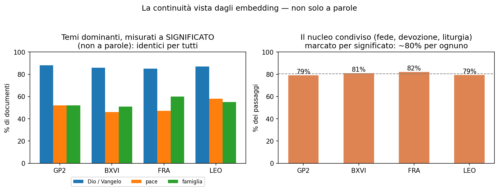
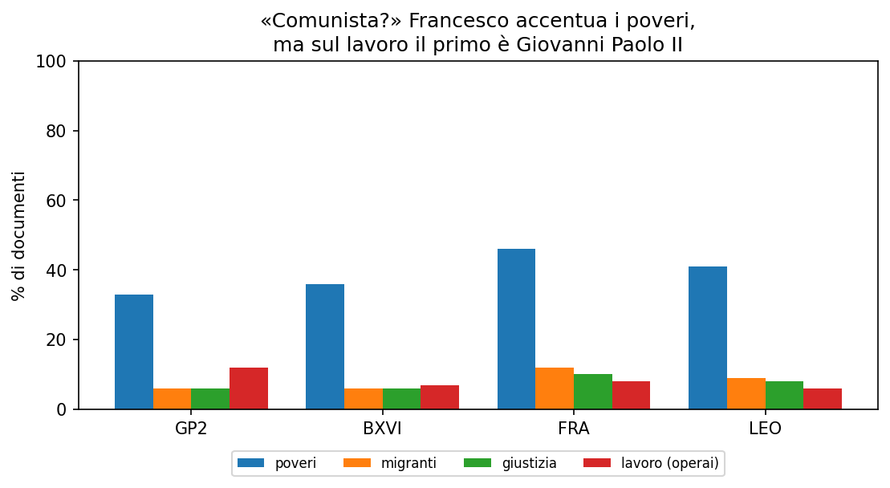
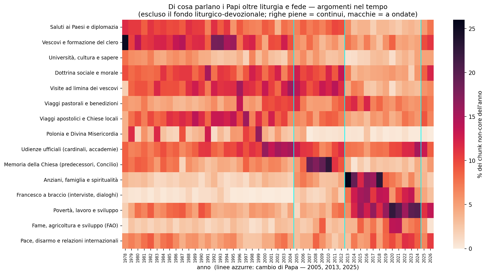

# Di cosa parlano i Papi

*Venticinquemila discorsi di quattro Papi, messi in fila e contati — per
rispondere coi numeri, e non con le impressioni, alle domande che ci si fa tra
amici.*

---

Su Francesco gira una narrazione fissa, quella dei giornali: è comunista, ha rotto
con i Papi di prima, parla solo di migranti. Sono le stesse cose che ci si dice tra
amici, di solito a colpi di sensazioni. I dati, però, cosa dicono?

Abbiamo preso circa venticinquemila testi dei quattro Papi più recenti — Giovanni
Paolo II, Benedetto XVI, Francesco e Leone XIV — e li abbiamo dati a un programma
che non cerca solo le parole, ma capisce il senso delle frasi. Poi abbiamo seguito
le domande una per una, con una regola sola: a ogni domanda cambiamo strumento di
misura, e teniamo buona una risposta solo se strumenti diversi danno lo stesso
numero.

## Di cosa è fatto un Papa

Se prendi tutto quello che dice un Papa, di che cosa è fatto? Abbiamo diviso gli
argomenti in sei famiglie — liturgia; fede e devozione; gli eventi che gli
organizzano; i viaggi; il programma del pontificato; l'attualità — e assegnato ogni
passaggio dei discorsi alla famiglia più vicina per significato. Non i discorsi
interi, ma i pezzi: un'omelia mischia liturgia e attualità nella stessa pagina.

> **Come, tecnicamente.** Ogni passaggio (~180 parole) diventa un vettore con il
> modello multilingue `multilingual-e5-base`. I vettori sono normalizzati, quindi
> confrontarli è fare un coseno: misuriamo ogni passaggio contro sei frasi-ancora,
> una per famiglia, e gli diamo la più vicina. Nessuna soglia, solo "qual è
> l'ancora più vicina".

Il risultato è netto: circa l'**80% è la stessa cosa per tutti e quattro** — Dio,
Gesù, Maria, il Vangelo, i sacramenti. La chiamiamo la linea rossa. I temi da prima
pagina vivono nel 20% che resta.

Le sei famiglie, però, le abbiamo scelte noi. Allora abbiamo fatto la prova
opposta: lasciare che gli argomenti si raggruppassero da soli, senza suggerirne
nessuno. Tornano le stesse aree — il fondo liturgico-devozionale, poi viaggi,
eventi, programma, attualità. La nostra ipotesi e il dato dicono la stessa cosa, ed
è il motivo per cui ci fidiamo del resto.

## Continuità o rottura?

Se il fondo è identico per tutti, dov'è finita la rottura di Francesco? Guardiamo i
temi che dominano: parlare di Dio e del Vangelo, della pace, della famiglia.
Misurati per significato valgono quasi le stesse percentuali per ognuno — Dio e
Vangelo intorno all'85%, la pace intorno al 50%, la famiglia intorno al 52%.

> **Come, tecnicamente.** Tre lenti sullo stesso tema. *A parole*: liste di radici
> (regex), quota di documenti che ne contengono almeno una. *A significato*: il
> tema descritto a frase, si prendono i documenti più vicini (coseno sugli e5) in
> **pari numero** ai positivi a parole — stesso volume, così si confrontano
> distribuzioni e non soglie. *A raggruppamento*: i gruppi che emergono da soli.
> Quando le tre concordano, il numero è solido.

È continuità, non rottura: Francesco cambia gli accenti, non la sostanza.

## Francesco è comunista?

Resta il sospetto vero: poveri, migranti, disuguaglianze. I numeri danno ragione,
in parte, al titolo di giornale. Sui poveri Francesco arriva al 46% dei suoi
documenti, contro il 33-36% di Giovanni Paolo II e Benedetto; sui migranti al 12%
contro il 6%; sulla giustizia sociale al 10% contro il 6%. È il suo timbro.

Due cose, però, ridimensionano la parola "comunista". La prima: sono temi piccoli
accanto a Dio, pace e famiglia, e li trattano tutti e quattro — è la dottrina
sociale della Chiesa, vecchia di oltre un secolo. La seconda è la riga che conta
davvero, quella del lavoro e degli operai: il primo non è Francesco, è **Giovanni
Paolo II**, al 12% dei suoi documenti contro l'8% di Francesco. Cioè il Papa che ha
contribuito a far cadere il comunismo. Parlare di poveri non rende comunisti.

Stessa storia per l'ambiente: ne parlano tutti più o meno uguale, tra il 16% e il
19% dei documenti. Di Francesco non è il tema, è il modo di dirlo — la formula
"casa comune" della *Laudato si'*.

## E nel tempo?

Un ultimo taglio, il più severo. Togliamo il fondo — liturgia, fede e devozione,
che già sappiamo continuo per tutti — e teniamo solo il resto: gli argomenti che
restano quando levi la parte dovuta dal ruolo. Quelli li lasciamo emergere dai
dati, gli diamo un nome leggendoli, e li contiamo anno per anno.

> **Come, tecnicamente.** Si tengono i soli passaggi non liturgici e non
> devozionali, si raggruppano per significato (un KMeans condiviso tra i quattro
> Papi, così un argomento vale lo stesso per tutti) e a ogni gruppo si dà un nome
> leggendone i passaggi tipici. Poi: la quota di ogni argomento, anno per anno.

Si legge così: ogni riga è un argomento, ogni colonna un anno, più scuro vuol dire
che se ne è parlato di più; le righe azzurre sono i cambi di Papa. Due avvertenze
prima della storia. Anche qui metà degli argomenti è istituzionale — visite dei
vescovi, udienze, viaggi, diplomazia: roba dettata dal ruolo, non scelta. E il
grosso del testo è di Giovanni Paolo II, che ha scritto molto più degli altri:
contano le quote, non i numeri secchi.

Detto questo, gli argomenti di contenuto si muovono, e quasi sempre al cambio di
Papa. Le visite *ad limina* e la Polonia sono fitte negli anni di Giovanni Paolo II
e si schiariscono dopo. Povertà e lavoro, fame e agricoltura (la FAO) e il registro
"a braccio" di Francesco — interviste, dialoghi — si accendono dal 2013 e restano
con Leone. Pace e disarmo va a tratti, segue le guerre del momento. Il fondo che
abbiamo tolto, invece, non si muove.

Una cautela: la heatmap dice *che* un argomento va a ondate, non ancora *cosa*
contiene di preciso quell'ondata. Per quello serve scendere nel dettaglio, una
macchia alla volta — ed è lavoro per le analisi che verranno.

## La morale

Da qualunque lato la si guardi, viene fuori la stessa cosa: non un Papa contro gli
altri, ma una voce sola che sposta accenti e parole su un fondo che resta.
Francesco accentua i poveri e i migranti, è vero; ma sul lavoro lo batte Wojtyła, e
l'ottanta per cento di quello che dicono i quattro è lo stesso. Continuità piena,
comunismo no.

---

*Solo conteggi e percentuali, mai i testi (sono © Libreria Editrice Vaticana). Il
"come" di ogni numero, passo per passo, è nell'[appendice tecnica](appendice-tecnica.md),
che porta ai notebook con il codice.*
